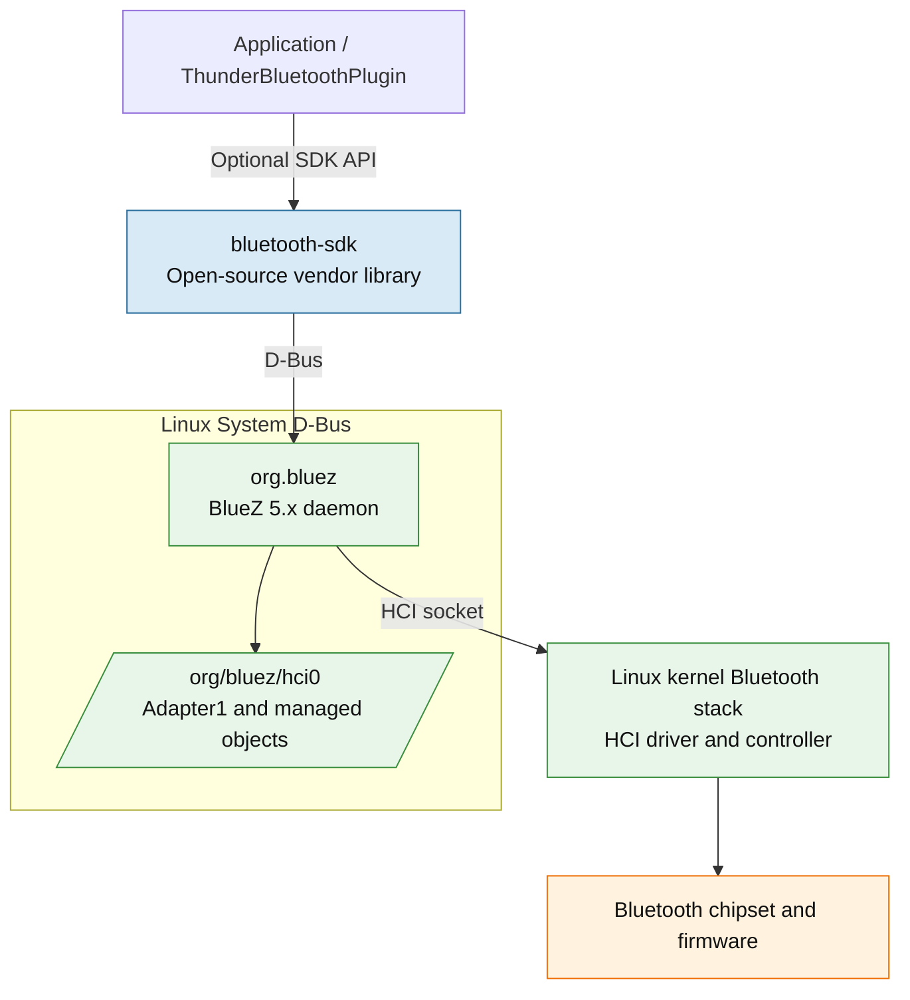

# RDK-E Bluetooth Architecture and Vendor Requirements

This document describes the common requirements expected from a Bluetooth vendor implementation and the available vendor-level validation tests.

## Table of Contents

- [Middleware Communication with BlueZ](#middleware-communication-with-bluez)
- [Vendor Requirements — Common to Any BT Stack](#vendor-requirements--common-to-any-bt-stack)
- [Test Assessment](#test-assessment)

## Middleware Communication with BlueZ

**Transport:** Bluetooth middeware communicates directly with the BlueZ daemon over the **Linux System D-Bus** using `sdbus-c++`; applications do not need to call BlueZ D-Bus APIs directly.

---

## Vendor Requirements — Common to Any BT Stack

These requirements apply regardless of the underlying stack. They define what a vendor BSP/platform must provide for the RDK-E Bluetooth middleware to function.

---

### 1. Hardware & Chipset

| Requirement | Detail |
|---|---|
| BT chipset present and enumerated | Visible as `/dev/hciX` or equivalent IPC endpoint |
| Minimum chipset version | Bluetooth Core 4.1+ — acceptable only for headset-only use cases (no BLE) |
| Recommended chipset version | Bluetooth Core 5.0+ — required for BLE, LE Extended Advertising, higher throughput |
| UART / USB / SDIO transport operational | Physical link between SoC and BT chipset must be up |
| Firmware loaded at boot | Chipset firmware blob must be loaded before stack starts |
| Firmware loading tool provided | e.g., `hciattach`, `btattach`, or vendor-specific tool |

---

### 2. Kernel / OS Requirements

| Requirement | Detail |
|---|---|
| Linux kernel ≥ 4.14 | Required for stable BLE and HCI socket support |
| HCI kernel driver loaded | e.g., `hci_uart`, `hci_bcm`, `hci_qca`, `btusb` |
| `AF_BLUETOOTH` socket support compiled | Required for HCI user-space socket access |
| `/dev/hciX` device node present | Used by BlueZ and the Linux Bluetooth stack to communicate with the kernel |
| `CONFIG_BT`, `CONFIG_BT_HCIUART` (or relevant transport) enabled in kernel config | |
| D-Bus system daemon running | Required when using BlueZ or any D-Bus-based stack |
| Minimum BlueZ version | BlueZ 5.48 |
| Recommended BlueZ version | Newest BlueZ qualified for the platform (deployed examples: 5.66 on broadband, 5.82 on Xi6) |

---

### 3. BT Stack Requirements (Stack-Agnostic)

Regardless of which stack is used, it must expose the following capabilities. 

| Capability | Minimum Profile Version | BlueZ interface | Required for |
|---|---|---|---|
| Adapter power on/off | Core Spec | `Adapter1.Powered` | All operations |
| Adapter discovery start/stop | Core Spec | `Adapter1.StartDiscovery` / `StopDiscovery` | Scan |
| Device pair / unpair | Core Spec | `Device1.Pair` / adapter `RemoveDevice` | Pairing |
| Device connect / disconnect |  Core Spec| `Device1.Connect` / `Disconnect` | Connection |
| Pairing agent (PIN/passkey/auth) | Core Spec | `Agent1` / `AgentManager1` | Secure pairing |
| A2DP media endpoint registration |  1.3 | `Media1.RegisterEndpoint` / `MediaEndpoint1` | Audio out |
| Audio transport acquire/release | 1.3 | `MediaTransport1.Acquire` / `Release` | Audio streaming |
| AVRCP media control | 1.5 | `MediaControl1` / `MediaPlayer1` | Media control |
| GATT client (read/write/notify) | Core Spec | `GattCharacteristic1` | BLE devices |
| GATT server registration | Core Spec | `GattManager1.RegisterApplication` | LE onboarding, diagnostics |
| BLE advertisement | Core Spec | `LEAdvertisingManager1` / `LEAdvertisement1` | LE peripheral role |
| Battery level reporting |  1.1 | `Battery1.Percentage` or GATT Battery Service | Device status |
| Device properties (RSSI, UUIDs, Class) | 1.1 | `Device1` properties | Device information |

---

### 4. Audio Requirements

| Requirement | Detail |
|---|---|
| A2DP Sink support (audio output to BT speaker/headphones) | Mandatory |
| SBC codec support | Mandatory baseline codec |

---

### 5. Profile & Protocol Support

| Profile / Protocol | Required | Used by |
|---|---|---|
| GAP (Generic Access Profile) | Mandatory | Discovery, connection |
| GATT (Generic Attribute Profile) | Mandatory | BLE devices, LE onboarding |
| A2DP (Advanced Audio Distribution) | Mandatory | Audio streaming |
| AVRCP (Audio/Video Remote Control) | Mandatory | Media control |
| HID (Human Interface Device) | Required | Gamepad, remote |
| BLE Advertisement | Required | LE peripheral role |
| SDP (Service Discovery Protocol) | Required | Classic BT service discovery |
| L2CAP | Mandatory | Base transport layer |

---

### 6. Security Requirements

| Requirement | Detail |
|---|---|
| Pairing agent capable of PIN/Passkey/Just Works | All three pairing modes must be supportable |
| Secure Simple Pairing (SSP) supported | Bluetooth 2.1+ requirement |
| LE Secure Connections (LESC) supported | BT 4.2+ requirement |
| Authentication callback mechanism | Stack must invoke the SDK/application authorization callbacks during pairing |
| Pairing rejection supported | SDK/application must be able to reject unauthorized connections |
| GATT authorization | Stack must support encrypted/authenticated GATT characteristics |

---

### 7. Integration Requirements with RDK-E Stack

| Requirement | Detail |
|---|---|
| bluetooth-sdk must initialize without errors | SDK creates a valid `sdbus-c++` connection and BlueZ proxy |
| BlueZ must be available before the application starts Bluetooth operations | Application/SDK initialization depends on the `org.bluez` D-Bus service and adapter being available |
| BT adapter must be discoverable through BlueZ D-Bus | SDK enumerates `/org/bluez/hciX` adapter objects |
| Stack must survive application restart | Applications may restart without rebooting the Bluetooth stack |
| Stack log integration | Stack logs must be accessible via RDK log framework |

---

## Test Assessment

`bluetoothctl` is BlueZ's own interactive CLI tool — so the vendor tests directly exercise BlueZ commands.

- [bluetoothctl test directory](https://github.com/rdkcentral/L4-vendor_system_tests/tree/main/tests/systemTests/bluetoothctl)
- [BluetoothCtl Research](https://github.com/rdkcentral/L4-vendor_system_tests/wiki/Bluetooth%E2%80%90Ctl-Research)
-  [BluetoothCtl Design Approach](https://github.com/rdkcentral/L4-vendor_system_tests/wiki/Bluetooth%E2%80%90Ctl-Tests-Design-Approach)
